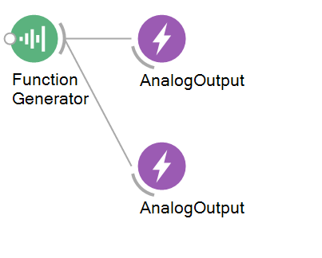

# Galvo Driver Workflow

### Purpose
This workflow is to help control galvonometric mirrors in our experimental paradigm, but also can be used to initialise their use in your broader workflow.

## Hardware Requirements
- National Instrument Data Acquisition (NIDAQ) device
- Galvonometric mirrors with assorted wiring, and power source unit

Note: Depending on your current version of NIDAQ software you may not be able to run this workflow. Please depreciate to a version before or equal to 19.0 if possible. See: https://github.com/orgs/bonsai-rx/discussions/2094

## Bonsai Workflow
This workflow establishes basic commnication between your galvonometric mirrors and your workflow. 

## Properties
The properties of this workflow allow the user to configure the parameters needed to control their galvonometric mirrors by using a simple function generator which can be customised. This workflow can be used to inititalise hardware in a wider experimental workflow.

### Input and Output `Subjects`
| **Property Name**       | **Input/Output** | **Description**                                                           |
|-------------------------|------------------|---------------------------------------------------------------------------|
| `FunctionGenerator`     | Input            | The name of the input subject that sends commands to the device.          |
| `AnalogOutput`          | Output           | The name of the subject that receives event messages from the device.     |
### Configuration Parameters
| **Property Name**       | **Input/Output** | **Description**                                                                                       |
|-------------------------|------------------|-------------------------------------------------------------------------------------------------------|
| `Amplitude`             | Input            | Sets the amplitude of the signal waveform                                                             |
| `BufferLength`          | Input            | Sets the number of samples in each output                                                             |
| `Depth`                 | Input            | Sets the bit depth of each element in the output                                                      |
| `DepthSpecified`        | Input            | Gets a value indicating whether Depth should be serialised                                            |
| `Frequency`             | Input            | Sets the frequency of the signal waveform in Hz                                                       |
| `Offset`                | Input            | Sets an optional DC-offset of the signal waveform                                                     |
| `Phase`                 | Input            | Sets an optional phase offset of the signal waveform in radians                                       |
| `SampleRate`            | Input            | Sets the sampling rate of the generated signal waveform in Hz                                         |
| `Waveform`              | Input            | Sets a value specifying the periodic waveform used to sample the signal                               |
| `BufferSize`            | Input            | Sets the number of samples to generate for finite samples, or size of buffer for continuous samples   |
| `Channels`              | Input            | Gets the collection of analog output channels used to generate voltage signals                        |
| `SampleMode`            | Input            | Sets a value specifying whether a finite number of samples is generated or a continuous generation    |

## Dependencies
### Bonsai:
In order to use this module, Bonsai must have the following modules installed via the package manager or 'Bonsai.config' file.
- [DAQmx](https://www.nuget.org/packages/Bonsai.DAQmx)
- [Dsp] (https://www.nuget.org/packages/Bonsai.Dsp)
- [Dsp.Design](https://www.nuget.org/packages/Bonsai.Dsp)

