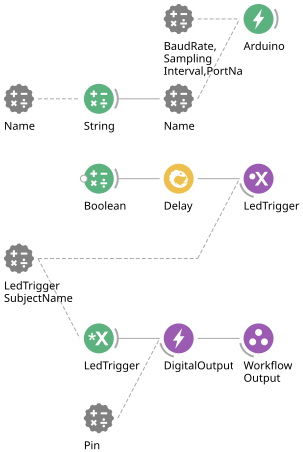

# LED Driver Workflow 

### Purpose
This workflow is to help set up LEDs in our behavioural paradigm, but also can be used to initialise LEDs to be used however you wish to.

## Hardware Requirements
- Arduino Board

## Bonsai Workflow
This workflow establishes basic commnication between your LED devices and your workflow. 

## Properties
The properties of this workflow allow the user to configure the parameters needed to control their LEDs by using Boolean logic. This workflow can be used to initialise this hardware in wider behavioural workflows. 

### Input and Output `Subjects`
| **Property Name**       | **Input/Output** | **Description**                                                           |
|-------------------------|------------------|---------------------------------------------------------------------------|
| `TriggerOn`             | Input            | The name of the input subject that sends commands to the device.          |
| `TriggerOff`            | Input            | The name of the subject that receives event messages from the device.     |

### Configuration Parameters
| **Property Name**       | **Input/Output** | **Description**                                                           |
|-------------------------|------------------|---------------------------------------------------------------------------|
| `PortName`              | Input            | Serial port used to communicate with the device (e.g., COM14).            |
| `Pin`                   | Output           | Output pin number on which to write boolean state values        |

## Dependencies
### Bonsai:
In order to use this module, Bonsai must have the following modules installed via the package manager or 'Bonsai.config' file.
- [Arduino](https://www.nuget.org/packages/Bonsai.Arduino)