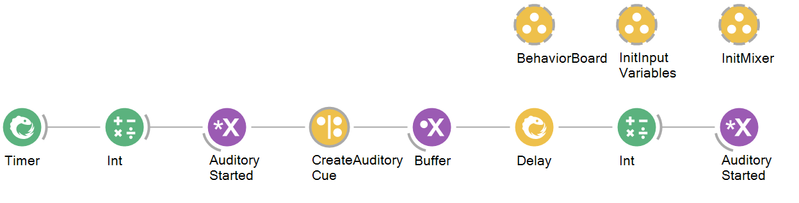

### Speaker Playback Workflow

### Purpose
This workflow exists to set up audio playback on a multi-speaker hardware configuration in Bonsai, which can be used for testing to check functionality and subsequent integration if needed into behavioural and experimental workflows. It can also be used for speaker calibration and hardware diagnostics.

## Hardware Requirements
- Speakers
- BehaviorBoard

## Bonsai Workflow
This workflow sets up the audio mixer and buffer pipeline for an audio stimulus to play on multiple speakers for testing purposes. 

## Properties 
The properties of this workflow allow the user to configure the parameters needed to communicate between their devices and produce a auditory stimulus of choice on a multi-speaker set-up.

### Input and Output `Subjects`
| **Property Name**       | **Input/Output** |**Description**                                                           |
|-------------------------|---------------------------------------------------------------------------------------------|
| `Timer`   | Input            | The name of the subject generating a periodic observable output of an auditory stimulus         |
| `Int`      | Input            | The name of the subject that represents a property containing an integer for initialising auditory stimulus state.     |
| `Byte`      | Input            | The name of the subject that represents a property containing an integer for initialising speaker signal.  |
| `BehaviorCommands`      | Input            | The name of the subject that receives and stores command messages from the BehaviorBoard    |
| `BehaviorEvents`   | Input            | The name of the subject receiving events from BehaviorBoard          |
| `Behavior`   | Input            | The name of the subject that initialises connections to BehaviorBoard and allows for configuration of hardware parameters          |
| `Behavior.OutputClearPayload`      | Input            | The name of the subject that creates a message payload that clear the specified digital output lines.     |
| `Behavior.OutputPulseEnablePayload`      | Input            | The name of the subject that creates a message payload that enables the pulse function on the board |
| `Behavior.PulseDO2Payload`      | Input            | The name of the subject that specifies the duration of the output pulse in milliseconds   |
| `CreateMixerContent`   | Input            | The name of the subject that creates a new mixer stream to control simultaneous output of multiple audio buffers          |
| `Buffer`      | Input            | The name of the subject that receives buffer content created in the workflow for playback.     |
| `Mixer`      | Input            | The name of the subject that receives mixer content for buffer queueing from other parts of the workflow  |
| `FunctionGenerator`      | Input            | The name of the subject that generates signal waveforms for any set of common periodic functions    |
| `BehaviorCommands`      | Output            | The name of the subject that publishes merged command sequences for the board to use    |
| `BehaviorEvents`   | Output            | The name of the subject that publishes events received from BehaviorBoard to other parts of the workflow         |
| `Buffer`      | Output            | The name of the subject that publishes audio data to broadcasted subject nodes elsewhere in the workflow.     |
| `AuditoryStarted`      | Output            | The name of the subject that broadcasts to other parts of the workflow whether the stimulus is actively playing or not  |
| `Mixer`      | Output            | The name of the subject that stores and broadcasts mixer content for use by other parts of the workflow    |
| `SpeakerSignal`      | Output            | The name of the subject that stores and publishes initialised signal to other places in workflow for usage    |

### Configuration Parameters
| **Property Name**       | **Input/Output** | **Description**                                                                                       |
|-------------------------|------------------|-------------------------------------------------------------------------------------------------------|
| `DumpRegisters`             | Input            | Specifies whether the device should send content of all registers during initialisation                                                               |
| `Heartbeat`          | Input            | Specifies if the device sends the timestamp event each second                                                  |
| `IgnoreErrors`             | Input            | Specifies whether error messages parsed during acquisition should be ignored or raise an error                                                              |
| `OperationLed`          | Input            | Specifies the state of the LED reporting device operation         |  
| `OperationMode`             | Input            | Specifies the operation mode of the device at initialisation                                                              |
| `PortName`          | Input            | Specifies the serial port used to communicate with the device      |  
| `VisualIndicators`             | Input            | Specifies the state of visual indicators in the device                                                             |
| `MessageType`          | Input            | Specifies the type of created message           |
| `OutputClear`             | Input            | Specifies the value the clears the specified digital output lines                                                             |
| `Payload`          | Input            | Specifies the operator used to create specific device message payloads           |
| `OutputPulseEnabled`             | Input            | Specifies the value that enables the pulse function for the specified output lines                                                             |
| `PulseDO2`          | Input            | Specifies the value that is the duration of the output pulse in milliseconds           |
| `Amplitude`             | Input            | Sets the amplitude of the signal waveform                                                             |
| `BufferLength`          | Input            | Sets the number of samples in each output                                                             |
| `Depth`                 | Input            | Sets the bit depth of each element in the output                                                      |
| `DepthSpecified`        | Input            | Gets a value indicating whether Depth should be serialised                                            |
| `Frequency`             | Input            | Sets the frequency of the signal waveform in Hz                                                       |
| `Offset`                | Input            | Sets an optional DC-offset of the signal waveform                                                     |
| `Phase`                 | Input            | Sets an optional phase offset of the signal waveform in radians                                       |
| `SampleRate`            | Input            | Sets the sampling rate of the generated signal waveform in Hz                                         |
| `Waveform`              | Input            | Sets a value specifying the periodic waveform used to sample the signal                               |
| `BufferSize`            | Input            | Sets the number of samples to generate for finite samples, or size of buffer for continuous samples   |
| `Channels`              | Input            | Gets the collection of analog output channels used to generate voltage signals                        |
| `SampleMode`            | Input            | Sets a value specifying whether a finite number of samples is generated or a continuous generation    |
| `ColumnTiles`            | Input            | Sets the desired number of times to repeat each array in the horizontal dimension   |
| `RowTiles`              | Input            | Sets the desired number of times to repeat each array in the horizontal dimension    |
| `Depth`            | Input            | Sets the optional bit depth of each element in the output array   |
| `Scale`              | Input            | Sets the optional scale factor to apply to array elements    |
| `Shift`            | Input            | Sets the optional value to be added to each array element   |
| `DeviceName`            | Input            | Sets the device that should be used to implement audio processing                                         |
| `HostApi`              | Input            | Sets the host API that should be used to implement audio processing                               |
| `SampleRate`            | Input            | Sets the desired sample rate of the output stream in seconds   |
| `SuggestedLatency`              | Input            | Sets the desired latency of output in seconds    |

## Dependencies
### Bonsai:
In order to use this module, Bonsai must have the following modules installed via the package manager or 'Bonsai.config' file.

[Bonsai.Harp] (https://www.nuget.org/packages/Bonsai.Harp)
[Harp.Behavior] (https://www.nuget.org/packages/Harp.Behavior)
[Bonsai.Mixer] (https://www.nuget.org/packages/Bonsai.Mixer)
[Bonsai.Dsp] (https://www.nuget.org/packages/Bonsai.Dsp)
[Bonsai.Dsp.Design] (https://www.nuget.org/packages/Bonsai.Dsp.Design)
[Aeon.Acquisition] (https://www.nuget.org/packages/Aeon.Acquisition)