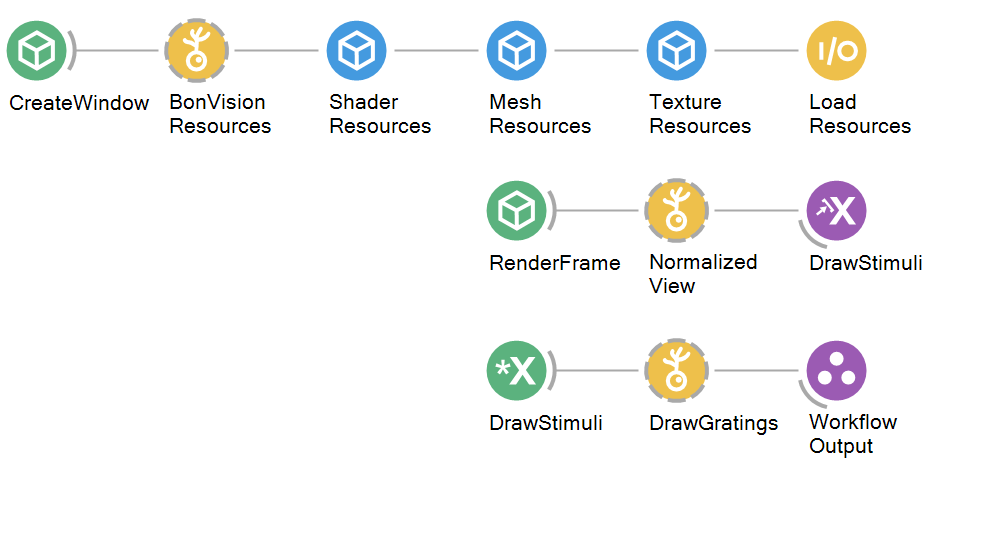

# Visual Playback Workflow

### Purpose 
This workflow initialises visual stimuli to be displayed on a hardware device of choice by receiving rendering commands from other workflows. These visual stimuli can be changed via multiple parameters to produce a stimulus of choice to be used in wider behavioural and experimental workflows. 

## Hardware Requirements
- Display device 

## Bonsai Workflow
This workflow sets up the graphics pipeline for visual stimulus presentation and allows for parameter settings to be changed.

## Properties 
The properties of this workflow allow the user to configure the parameters needed to allow rendering of a visual stimulus of choice onto a display device

### Input and Output `Subjects`
| **Property Name**       | **Input/Output** |**Description**                                                           |
|-------------------------|---------------------------------------------------------------------------------------------|
| `DrawStimuli`   | Input            | The name of the subject rendering commands and visual stimulus parameters          |
| `CreateWindow`      | Input            | The name of the subject that creates the shader window to be displayed as a background for the stimulus.     |
| `RenderFrame`      | Input            | The name of the subject that generates a sequence of events when it is time to render a new frame  |
| `DrawStimuli`      | Output            | The name of the subject that publishes rendered context for visual stimulus presentation to other aspects within a workflow    |

### Configuration Parameters
| **Property Name**       | **Input/Output** | **Description**                                                                                       |
|-------------------------|------------------|-------------------------------------------------------------------------------------------------------|
| `Window Style`             | Input            | Takes in parameters to set window width, height,location, and border presence, cursor visibility and state of window                                                              |
| `Render Settings`          | Input            | Takes in parameters to set the colour to clear the buffer before rendering, which buffers to clear, which device to use, which graphics to use, the initial rendering state of the window, and window rendering and update frequencies                                                    |

## Dependencies
### Bonsai:
In order to use this module, Bonsai must have the following modules installed via the package manager or 'Bonsai.config' file.
- [Bonsai.Shaders] (https://www.nuget.org/packages/Bonsai.Shaders)
- [Bonsai.Shaders.Design] (https://www.nuget.org/packages/Bonsai.Shaders.Design)
- [Bonvision](https://www.nuget.org/packages/BonVision)

