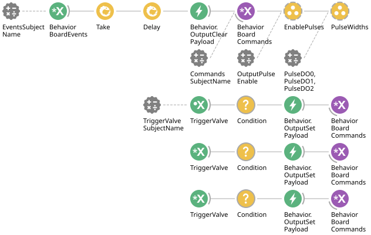

# Harp Behavior Board Interface

This module configures an existing [Harp Behavior](https://github.com/harp-tech/device.behavior) device's digital output pulses. This module can be added to a workflow that already contains a [`BehaviorBoard.bonsai`](./BehaviorBoard.bonsai) module.

## Bonsai Workflow

## Properties

This workflow exposes properties that allow a user to configure the device behavior and integrate it into larger Bonsai pipelines via `Subjects`.

### Input and Output `Subjects`

| **Property Name**         | **Input/Output** | **Description**                                                                 |
|---------------------------|------------------|---------------------------------------------------------------------------------|
| `CommandsSubjectName`     | Input            | The name of the input subject that sends configuration and control commands. **N.B. Must match the `CommandsSubjectName` in the properties of the `BehaviorBoard` module.**   |
| `EventsSubjectName`       | Output           | The name of the subject that receives event messages from the device. **N.B. Must match the `EventssSubjectName` in the properties of the `BehaviorBoard` module.**           |
| `TriggerValveSubjectName` | Input            | Subject that carries integer values (0–2) to trigger individual output ports.   |

### Configuration Parameters

| **Property Name**         | **Input/Output** | **Description**                                                                 |
|---------------------------|------------------|---------------------------------------------------------------------------------|
| `OutputPulseEnable`       | Input            | Configures which digital outputs (e.g., DO0–DO2) are enabled for pulse control. |
| `PulseDO0`                | Input            | Pulse width value (in ms) for DO0.                                              |
| `PulseDO1`                | Input            | Pulse width value (in ms) for DO1.                                              |
| `PulseDO2`                | Input            | Pulse width value (in ms) for DO2.                                              |
| `Value`                   | Input            | Used in conditional branches to check equality for triggering output sets.      |

## Dependencies

### Bonsai:

- [Harp.Behavior](https://www.nuget.org/packages/Harp.Behavior)
- [BehaviorBoard.bonsai](utilities\behavior-board-device\workflows\BehaviorBoard.bonsai) should be placed in your workflow