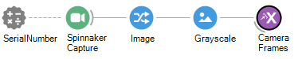

# Camera Aqcuisition Workflow 

### Purpose
The purpose of this workflow is to acquire frames from FLIR cameras.

## Hardware Requirements
- FLIR camera

## Bonsai Workflow
This workflow acquires frames from FLIR cameras.

## Properties
The properties of this workflow allow the user to specify the serial number of their FLIR camera. This is the 8-digit code located on the bottom of the camera. However, the SpinnakerCapture node should automatically detect the camera and serial number. 

### Input and Output `Subjects`
| **Property Name**       | **Input/Output** | **Description**                                                           |
|-------------------------|------------------|---------------------------------------------------------------------------|
| `CameraFrames`          | Output           | Outputs each frame acquired by the camera.                                |
### Configuration Parameters
| **Property Name**       | **Input/Output** | **Description**                                                           |
|-------------------------|------------------|---------------------------------------------------------------------------|
| `SerialNumber`          | Input            | Serial number of the FLIR camera                                          |

## Dependencies
### Bonsai:
In order to use this module, Bonsai must have the following modules installed via the package manager or 'Bonsai.config' file.
- [Spinnaker](https://www.nuget.org/packages/Bonsai.Spinnaker)
    - Please download v0.7.1, as the new version of the bonsai package is broken.
