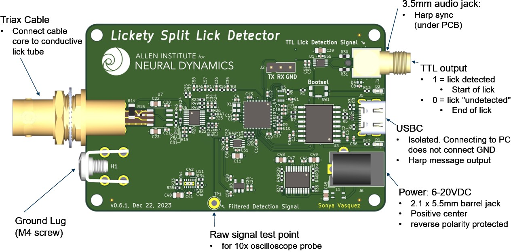
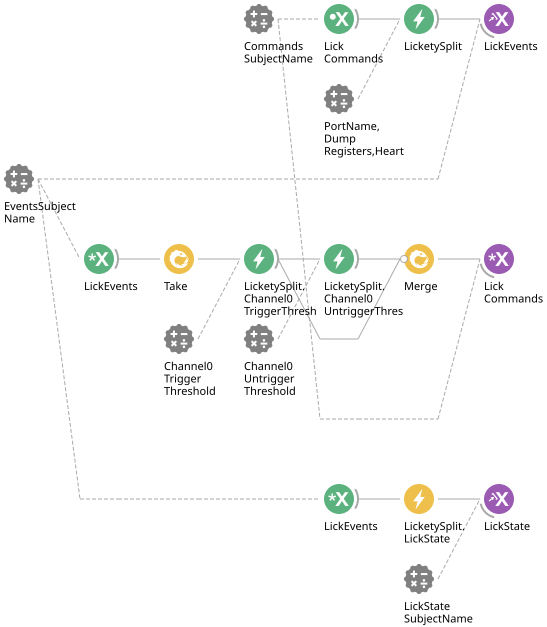

# LicketySplit interface

This module interfaces and configures a [LicketySplit](https://allenneuraldynamics.github.io/Bonsai.AllenNeuralDynamics/harp_devices_spec/Harp_LicketySplit.html) device by Allen Neural Dynamics:

## Bonsai Workflow

## Properties
The properties of this workflow allow the user to configure device parameters and set the name of shared `Subjects` to either publish or subscribe to as an interface between your broader Bonsai workflow and the device.
### Input and Output `Subjects`
| **Property Name**           | **Input/Output**      | **Description**                                                             |
|-----------------------------|-----------------------|-----------------------------------------------------------------------------|
| `CommandsSubjectName`       | Input                 | The name of the input subject that sends commands to the device.            |
| `EventsSubjectName`         | Output                | The name of the subject that receives event messages from the device.       |
| `LickStateSubjectName`      | Output                | The name of the subject that indicates the lick detector state (HIGH/LOW).  |
### Configuration Parameters
| **Property Name**           | **Input/Output**      | **Description**                                                             |
|-----------------------------|-----------------------|-----------------------------------------------------------------------------|
| `PortName`                  | Input                 | Serial port used to communicate with the device (e.g., COM4).               |
| `DumpRegisters`             | Input                 | Whether to dump register values from the device at startup.                 |
| `Heartbeat`                 | Input                 | Whether to enable heartbeat messages from the device.                       |
| `Channel0TriggerThreshold`  | Input                 | The voltage or signal threshold to detect a lick (rising edge).             |
| `Channel0UntriggerThreshold`| Input                 | The threshold to detect when a lick ends (falling edge).                    |

## Dependencies
### Bonsai:
[AllenNeuralDynamics.HarpUtils](https://www.nuget.org/packages/AllenNeuralDynamics.HarpUtils/)
