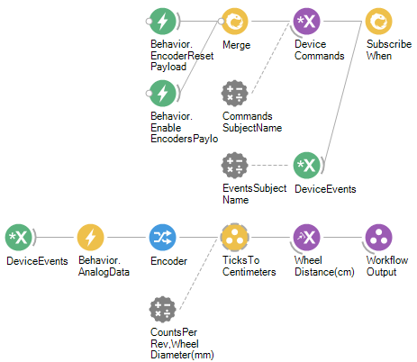

# Running Wheel Workflow 

### Purpose
The purpose of this workflow is to track the total distance moved by a running wheel.

## Bonsai Workflow
When this workflow first receives events from a [HARP behavior board](https://github.com/harp-tech/device.behavior) connected to a quadrature encoder, it sends commands to enable the encoder and resets its count to zero. 

Incoming device events are then filtered for analog inputs, and the quadrature encoder output is extracted. The encoder ticks are then converted into distance (in centimeters) using the user-defined encoder resolution (counts per revolution) and wheel diameter. 

The resulting distance in centimeters is the final output of the workflow.

## Properties
The properties of this workflow allow the user to define the encoder resolution (counts per revolution) and the running wheel diameter (in millimeters). These values are used to convert the encoder tick count into running distance (in centimeters). Note that the Kubler 05.2400.1122.1024 quadrature encoder produces 1024 counts per revolution, but the HARP board’s built-in quadrature counter uses x4 decoding. This means it counts all four edges of the A/B signals (rising and falling edges of both channels), giving an effective resolution of 4096 counts per revolution.

### Input and Output `Subjects`
| **Property Name**       | **Input/Output** | **Description**                                                           |
|-------------------------|------------------|---------------------------------------------------------------------------|
| `EventsSubjectName`     | Input            | The name of the subject that receives event messages from the device.     |
| `WheelDistance(cm)`     | Output           | The total distance the wheel has moved (in centimeters).                    |

### Configuration Parameters
| **Property Name**       | **Input/Output** | **Description**                                                           |
|-------------------------|------------------|---------------------------------------------------------------------------|
| `CountsPerRev`          | Input            | The tick counts per revolution of the wheel.                              |
| `WheelDiameter(mm)`     | Input            | The wheel diameter (in millimeters).                                        |

## Dependencies
### Bonsai:
In order to use this module, bonsai must have the following modules installed via the package manager or `Bonsai.config` file.
- [Harp.Behavior](https://www.nuget.org/packages/Harp.Behavior)