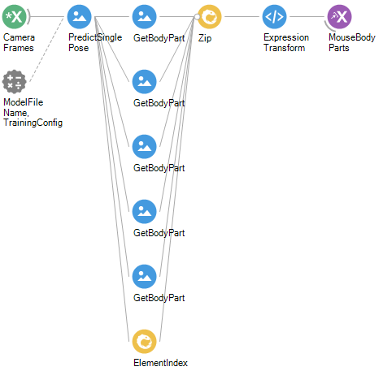

# Live Sleap Tracking Workflow 

### Purpose
The purpose of this workflow is to track the pose of a mouse using live Sleap tracking.

## Bonsai Workflow
This workflow accepts a pre-trained Sleap model as input and uses it to track the pose of a mouse from a series of image frames. It ouputs the x position, y position, and confidence of each body part for each frame. The pre-trained model should have the following body part instances: Nose, LeftEar, RightEar, Body, TailBase.

## Properties
The properties of this workflow allow the user to provide the path to their pre-trained model and config files. 

### Input and Output `Subjects`
| **Property Name**       | **Input/Output** | **Description**                                                           |
|-------------------------|------------------|---------------------------------------------------------------------------|
| `CameraFrames`          | Input            | The stream of image frames.                                               |
| `MouseBodyParts`        | Output           | The x pos, y pos, and confidence of each body part.                       |

### Configuration Parameters
| **Property Name**       | **Input/Output** | **Description**                                                           |
|-------------------------|------------------|---------------------------------------------------------------------------|
| `ModelFileName`         | Input            | The path to the frozen_graph.pb file.                                     |
| `TrainingConfig`        | Input            | The path to the training config JSON file.                                |

## Dependencies
### Bonsai:
In order to use this module, Bonsai must have the following modules installed via the package manager or 'Bonsai.config' file.
- [Sleap](https://www.nuget.org/packages/Bonsai.Sleap)
- [Sleap.Design](https://www.nuget.org/packages/Bonsai.Sleap.Design)