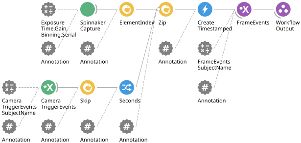

# Camera Trigger Workflow

### Purpose
This workflow exists to timestamp and index triggered camera frames from a Spinnaker camera in line with timestamped triggers originating from a behavior board or camera controller device.

## Hardware Requirements
- Spinnaker camera
- BehaviourBoard

## Bonsai Workflow
This workflow aligns camera frames triggered from an external device in time for usage by broader behavioural & experimental workflows, and analysis.

## Properties
The properties of this workflow allow the user to configure the parameters needed to allow communication between Spinnaker cameras, the BehaviorBoard, other Bonsai workflows and other Harp devices

### Input and Output `Subjects`
| **Property Name**       | **Input/Output** |**Description**                                                           |
|-------------------------|---------------------------------------------------------------------------------------------|
| `CameraTriggerEventsSubjectName`   | Input            | The name of the input subject that receives frame event data from the BehaviorBoard. **N.B. This must match `CameraTriggerEventsSubjectName` in your `CameraTriggerController` module.**        |
| `FrameEventsSubjectName`      | Output            | The name of the subject that receives timestamped and indexed camera event synchronised with trigger event messages from the device.     |

### Configuration Parameters
| **Property Name**       | **Input/Output** | **Description**                                                                                       |
|-------------------------|------------------|-------------------------------------------------------------------------------------------------------|
| `ExposureTime`             | Input            | Camera exposure duration in microseconds                                                             |
| `Gain`          | Input            | Sets the sensor gain multiplier                                                             |
| `Binning`                 | Input            | Sets the pixel binning factor for setting sensitivity                                                      |
| `SerialNumber`             | Input            | Sets serial number of Spinnaker cameras                                                        |
| `ColorProcessing`                | Input            | Sets mode for color processing                                                     |
| `TriggerEvents`                 | Output            | Name of the SubscribeSubject node for output to wider workflow that CameraTriggerEvents subscribes to                                      |

## Dependencies
### Bonsai:
In order to use this module, Bonsai must have the following modules installed via the package manager or 'Bonsai.config' file.
- [Bonsai.Spinnaker](https://www.nuget.org/packages/Bonsai.Spinnaker)
- [Bonsai.Harp](https://www.nuget.org/packages/Bonsai.Harp)
- [Behaviour Board utility](https://github.com/Coen-Lab/bonsai-workflows/tree/main/utilities/device-behavior-board)
- [Behaviour Board Camera Trigger Controller utility](https://github.com/Coen-Lab/bonsai-workflows/tree/main/utilities/device-behavior-board/add.cameraTriggerController.bonsai)

### External Software:
- [Spinnaker SDK 1.29.0.5] (https://www.teledynevisionsolutions.com/en-GB/products/spinnaker-sdk/?model=Spinnaker%20SDK&vertical=machine%20vision&segment=iis)

Note: use this version of Spinnaker with Bonsai Spinnaker version 0.7.1 for compatibility.